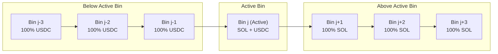
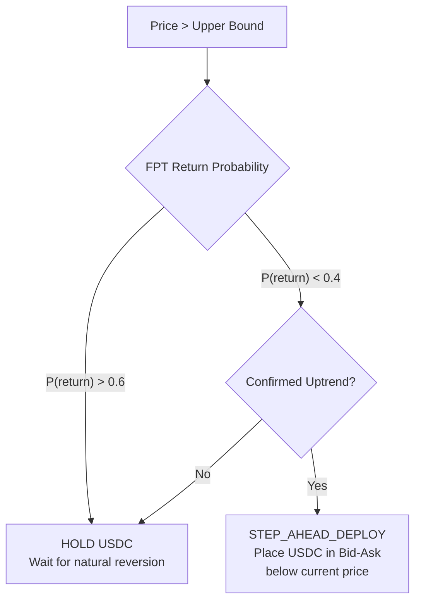
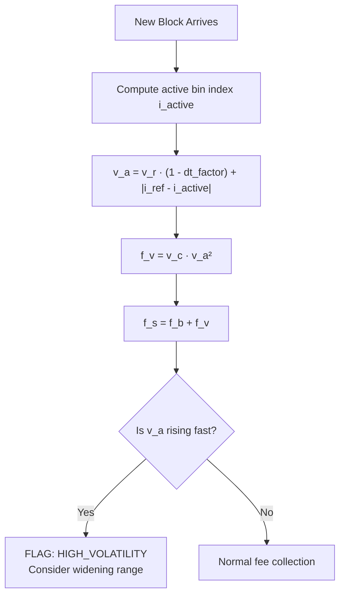
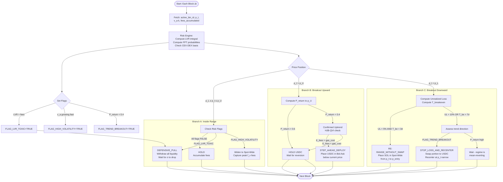

# Liquidity Pool Strategies — Quantitative Analysis & Simulation

**Based on:** Three quantitative research papers on Meteora DLMM SOL/USDC strategies  
**Protocol:** Meteora DLMM (Dynamic Liquidity Market Maker) on Solana  
**Simulation Target:** SOL/USDC pair with oracle-price backtesting

---

## Table of Contents

1. [Architecture of Meteora DLMM Bins](#1-architecture-of-meteora-dlmm-bins)
2. [Deterministic Outcomes — Position Topology](#2-deterministic-outcomes--position-topology)
3. [Fee Model — Volatility Accumulator](#3-fee-model--volatility-accumulator)
4. [Risk Framework — LVR, FPT, MFG](#4-risk-framework--lvr-fpt-mfg)
5. [Strategy Catalogue](#5-strategy-catalogue)
6. [Algorithmic Decision Tree](#6-algorithmic-decision-tree)
7. [Comparative Strategy Matrix](#7-comparative-strategy-matrix)
8. [Simulation Architecture](#8-simulation-architecture)
9. [Key Findings](#9-key-findings)
10. [References](#10-references)

---

## 1. Architecture of Meteora DLMM Bins

Meteora DLMM replaces the continuous hyperbolic invariant `x·y = k` (CPMM) with a **discrete bin architecture**. Each bin `j` uses a **constant-sum invariant**:

$$p_j \cdot x_j + y_j = L_j$$

Where:
- $p_j$ — fixed price of bin $j$ (constant within the interval)
- $x_j, y_j$ — reserves of SOL and USDC in bin $j$
- $L_j$ — total virtual liquidity of bin $j$

### Bin Price Formula

The price of bin with index $j$ is computed as:

$$p_j = (1 + s)^j \cdot p_0$$

Where $s$ is the bin step (in basis points, e.g. $s = 0.0025$ for 25 bps) and $p_0$ is the reference price.

### Active Bin Topology

At any moment, **only the active bin** contains both SOL and USDC. All bins *below* the active bin hold 100% USDC; all bins *above* hold 100% SOL.



---

## 2. Deterministic Outcomes — Position Topology

Given an LP position in range $[p_L, p_U]$, three deterministic outcomes exist:

### Outcome 1: Price Inside Range — $p_L \leq p_t \leq p_U$

**Condition:** Active bin is within the LP position  
**Economics:** Continuous fee accrual from swaps through the active bin  
**Action:** **HOLD** — inaction region by HJB-QVI theory

$$\text{Daily PnL} = \text{Fee}_{\text{accrual}} - \text{LVR}$$

Position is mathematically profitable when:

$$\int_0^T f_s(k) \, dt > \int_0^T \frac{\sigma^2(t)}{8} \cdot p^2(t) \cdot \left|\frac{\partial^2 y}{\partial p^2}\right| \, dt$$

### Outcome 2: Breakout Upward — $p_t > p_U$

**Condition:** Active bin drifted above the LP range  
**State:** Position is 100% USDC  
**Economics:** Profit locked in USD equivalent; opportunity cost (missed SOL upside); fee generation **stops**



### Outcome 3: Breakout Downward — $p_t < p_L$

**Condition:** Active bin drifted below the LP range  
**State:** Position is 100% SOL  
**Economics:** Unrealized loss in USD; fee generation **stops**; risk of compounding IL if further selling

**Average Entry Price on Downward Move:**

$$\bar{p}_{\text{entry}} = \frac{\sum_{j: p_j \in [p_L, p_U]} L_j \cdot p_j}{\sum_{j: p_j \in [p_L, p_U]} L_j}$$

**Unrealized Loss:**

$$\text{UL} = \bar{p}_{\text{entry}} - p_t$$

---

## 3. Fee Model — Volatility Accumulator

Meteora DLMM implements a **dynamic fee** that rises during high-volatility periods.

### Total Swap Fee

$$f_s = f_b + f_v(k)$$

### Base Fee

$$f_b = B \cdot s \cdot 10 \cdot 10^{\text{base\_fee\_power\_factor}}$$

Where $B$ is the base factor and $s$ is the bin step.

### Variable Fee

$$f_v(k) = v_c \cdot v_a(k)^2$$

Where $v_c$ is the variable fee control parameter.

### Volatility Accumulator

$$v_a(k) = v_r \cdot (1 - \text{dt\_factor}) + |i_{\text{ref}} - i_{\text{active}}(k)|$$

Where:
- $v_r$ — reference volatility (decays over time by factor $\text{dt\_factor}$ between blocks)
- $i_{\text{ref}}$ — reference bin index
- $i_{\text{active}}(k)$ — current active bin index



**Key Insight:** The derivative $\dot{v}_a$ serves as an early warning. Rapid bin crossing → exponential fee growth. Algorithms should widen positions to capture peak $f_v$ before range exit.

---

## 4. Risk Framework — LVR, FPT, MFG

### 4.1 Loss Versus Rebalancing (LVR)

LVR quantifies the continuous cost of adverse selection — the "leak" from arbitrageurs trading against stale AMM prices.

**Instantaneous LVR (continuous time):**

$$\ell(t) = \frac{\sigma^2(t)}{2} \cdot p^2(t) \cdot \left|\frac{\partial^2 y}{\partial p^2}\right|$$

Where:
- $\sigma(t)$ — local volatility of SOL/USDC
- $p(t)$ — oracle price
- $\frac{\partial^2 y}{\partial p^2}$ — second derivative of the reserve function w.r.t. price (liquidity density)

**Decision Rule:**

$$\text{FLAG\_LVR\_TOXIC} = \mathbb{1}\left[\int_{t-\Delta}^{t} \ell(u)\,du > \int_{t-\Delta}^{t} f_s(u)\,du\right]$$

When LVR exceeds fees over a rolling window, withdraw liquidity immediately.

### 4.2 First Passage Time (FPT) — Ornstein-Uhlenbeck Model

For ranging markets, price follows an **Ornstein-Uhlenbeck** (mean-reverting) process:

$$dp_t = \theta(\mu - p_t)\,dt + \sigma\,dW_t$$

Where $\theta$ is the mean-reversion speed, $\mu$ is the long-run mean, $\sigma$ is volatility, $dW_t$ is a Wiener process increment.

**Probability of returning to $\mu$ before hitting barrier $b$** (via scale functions):

$$P(\tau_\mu < \tau_b \mid p_0 = x) = \frac{S(b) - S(x)}{S(b) - S(\mu)}$$

Where $S(\cdot)$ is the scale function of the OU process:

$$S(x) = \int^x \exp\left(\frac{\theta (z - \mu)^2}{\sigma^2}\right) dz$$

**Algorithm Use:** If $P(\tau_\mu < \tau_b) > 0.6$ when price approaches a range boundary, **do not rebalance** — the expected fee revenue from staying exceeds rebalancing costs.

### 4.3 Mean Field Games (MFG) — Inaction Regions

The collective behavior of LPs creates equilibrium dynamics described by the Hamilton-Jacobi-Bellman quasi-variational inequality (HJB-QVI):

$$\min\left(-\partial_t V - \mathcal{L}V - \pi, V - \mathcal{M}V\right) = 0$$

Where $\mathcal{M}V$ is the intervention operator (rebalance action) and $\mathcal{L}$ is the infinitesimal generator.

**Key Result:** The HJB-QVI solution provably establishes **inaction regions** — bands around the current price where the optimal control $u^* = 0$ (no rebalancing). Only when the price process exits this band does optimal impulse control trigger.

This mathematically justifies the "Regime-Aware Laziness" strategy: aggressive rebalancing destroys alpha due to gas costs + slippage.

---

## 5. Strategy Catalogue

### Strategy 1: Passive Spot-Spread (Baseline)

| Parameter | Value |
|-----------|-------|
| **Shape** | Spot-Spread (20–50 bins) |
| **Capital** | 50% SOL / 50% USDC |
| **Timeframe** | 7–14 days |
| **Range** | ±5–10% from entry |
| **Action** | HOLD until breach |

**Math:** This strategy establishes the performance floor. All other strategies are measured against it.

---

### Strategy 2: Break-Even Re-ranging (Downside Breach)

**Trigger:** Price falls below $p_L$ — position becomes 100% SOL

**Core Insight:** Avoid market-selling SOL at a loss. Instead, use fee absorption to recover capital.

**Break-Even Time Calculation:**

$$T_{\text{breakeven}} = \frac{|\text{UL}|}{f_{\text{daily}}}$$

Where $f_{\text{daily}}$ is the estimated daily fee rate from the pool.

**Action:** Place SOL in Spot-Wide range $[p_t, \bar{p}_{\text{entry}}]$ — 50+ bins covering current price up to original average entry.

**Condition to Apply:**

$$|\text{UL}| < 5\% \quad \text{AND} \quad T_{\text{breakeven}} < 3 \text{ days}$$

---

### Strategy 3: Regime-Aware Laziness (RAmmStein)

**Based on:** RAmmStein paper (arXiv:2602.19419) — HJB-QVI optimal impulse control

**Core Insight:** Gas + slippage costs create a mandatory buffer zone. Rebalancing too frequently destroys returns.

**Empirical finding:** 67–85% reduction in rebalancing frequency with maintained capital efficiency.

**Decision Filter:**

```
IF P(return to μ before hitting boundary) > θ_lazy:
    ACTION = HOLD (inaction region)
ELSE:
    EVALUATE rebalancing cost vs expected fee revenue
    IF E[future_fees] - gas_cost - slippage > 0:
        ACTION = REBALANCE
```

---

### Strategy 4: Bid-Ask DCA-In (Single-Sided USDC)

**Paper:** Strategy 1 from paper (2) — Mean-Reverting Bid-Ask DCA-In

**Setup:** 100% USDC placed **below** current price in Bid-Ask (U-shape) distribution.

**Average Entry Price:**

$$\bar{p}_{\text{in}} = \frac{\int_{p_L}^{p_M} p \cdot L(p)\,dp}{\int_{p_L}^{p_M} L(p)\,dp}$$

Where $L(p)$ is the Bid-Ask liquidity shape (concentrated at $p_L$ and $p_M$, thin in the middle).

**Ideal Outcome:** Price dips into range → partial SOL acquisition → price recovers → double-cross fee collected → return to 100% USDC with zero IL.

**Full Downside:** Entire USDC converts to SOL at below-market prices. Average entry = $\bar{p}_{\text{in}} \approx 0.93 \cdot p_0$ (7% discount).

---

### Strategy 5: Momentum SOL DCA-Out (Single-Sided SOL)

**Paper:** Strategy 2 from paper (2) — Momentum-Chasing SOL Take-Profit Grid

**Setup:** 100% SOL placed **above** current price in Spot-Spread or Curve distribution.

**Hermes Integration:** Idle SOL in upper bins is automatically lent to protocols (Kamino, Solend) for lending yield. Retrieved instantly when price approaches.

**Total Return:**

$$R_{\text{total}} = R_{\text{fees}} + R_{\text{lending}} + R_{\text{price\_appreciation}}$$

**Full Upside:** All SOL sells into USDC at average price significantly above $p_0$. LP has locked profit.

---

### Strategy 6: Dynamic Impulse-Controlled Volatility Band (HJB-QVI)

**Paper:** Strategy 3 from paper (2) — Dynamic Impulse-Controlled

**Setup:** 100% USDC in Spot-Wide (50 bins) below current price. Uses OU + FPT gating.

**Action Region vs Inaction Region:**

$$\text{Action Region:} \quad P(\tau_\mu < \tau_{p_L}) < 0.4$$
$$\text{Inaction Region:} \quad P(\tau_\mu < \tau_{p_L}) \geq 0.4$$

**Long-term Advantage:** 85% reduction in rebalancing costs. Hermes lending yield during inaction periods. Suited for 30–90 day horizons.

---

## 6. Algorithmic Decision Tree



---

## 7. Comparative Strategy Matrix

| Parameter | S1: Spot-Spread | S2: Break-Even Re-range | S3: Regime-Aware Laziness | S4: Bid-Ask DCA-In | S5: SOL DCA-Out | S6: HJB-QVI Band |
|-----------|----------------|------------------------|--------------------------|-------------------|----------------|-----------------|
| **Capital Setup** | 50/50 SOL+USDC | 50/50 → auto | 50/50 + FPT filter | 100% USDC | 100% SOL | 100% USDC Wide |
| **Shape** | Spot-Spread | Spot-Wide (after breach) | Any + gating | Bid-Ask U-shape | Spot-Spread/Curve | Spot-Wide 50 bins |
| **Timeframe** | 7–14 days | 2–5 days recovery | 7–21 days | 7–14 days | 3–7 days | 30–90 days |
| **Best Market** | Low vol flat | Recovery after dip | Mean-reverting | Dip accumulation | Bull breakout | All regimes |
| **Main Risk** | IL + LVR | No recovery if macro dump | Miss fast breakouts | Deep crash below range | Bull trap reversal | High initial setup cost |
| **Rebalance Freq** | Medium | Low (1–2x per event) | Very Low (67–85% less) | Low | Low | Very Low |
| **Hermes Lending** | No | No | Optional | Optional | Yes (idle SOL) | Yes (idle USDC) |
| **Upside Bull** | Partial (sells SOL) | Partial | Filtered | None (USDC below) | Full (SOL above) | Filtered |
| **Downside Bear** | Full exposure | Break-even strategy | FPT gated | DCA-in at discount | None (SOL above) | Break-even HJB |
| **Fee Alpha** | Baseline | High (Spot-Wide during recovery) | Optimized | Double-cross on mean-reversion | Hermes + trading fees | Max efficiency long-term |

---

## 8. Simulation Architecture

```mermaid
graph TB
    subgraph "Data Layer"
        API[defi.services API\nOHLCV endpoint]
        SYNTH[Synthetic Price Generator\nOU + GBM fallback]
        API -->|500 error| SYNTH
        API -->|success| PRICE_DATA[Price Time Series]
        SYNTH --> PRICE_DATA
    end
    
    subgraph "DLMM Engine"
        PRICE_DATA --> BIN[Bin Engine\nDiscrete bins, active bin tracking]
        BIN --> FEE[Fee Calculator\nv_a accumulator, f_b + f_v]
        BIN --> RESERVE[Reserve Tracker\nSOL/USDC per bin]
    end
    
    subgraph "Risk Engine"
        FEE --> LVR_CALC[LVR Calculator\nσ² · p² · |∂²y/∂p²|]
        PRICE_DATA --> OU[OU Process Fitter\nθ, μ, σ estimation]
        OU --> FPT[FPT Calculator\nP(return to μ before barrier)]
    end
    
    subgraph "Strategy Layer"
        BIN --> S1[S1: Spot-Spread HOLD]
        BIN --> S2[S2: Break-Even]
        FPT --> S3[S3: Regime-Aware]
        BIN --> S4[S4: Bid-Ask DCA-In]
        BIN --> S5[S5: SOL DCA-Out]
        FPT --> S6[S6: HJB-QVI Band]
        LVR_CALC --> S3
        LVR_CALC --> S6
    end
    
    subgraph "Results"
        S1 --> PNL[PnL Tracker\nFees, IL, Gas Costs]
        S2 --> PNL
        S3 --> PNL
        S4 --> PNL
        S5 --> PNL
        S6 --> PNL
        PNL --> REPORT[Comparison Dashboard\nPlots + Metrics]
    end
```

### Synthetic Price Model Parameters (SOL/USDC calibrated)

| Parameter | Value | Source |
|-----------|-------|--------|
| Initial price $p_0$ | $150 | SOL approximate 2025 |
| Annual volatility $\sigma$ | 80% | Historical SOL |
| Mean-reversion speed $\theta$ | 0.05/day | Calibrated |
| Long-run mean $\mu$ | $150 | Entry price |
| Bin step $s$ | 25 bps (0.0025) | Meteora SOL/USDC |
| Base factor $B$ | 10000 | Meteora default |
| Gas cost per tx | $0.01 | Solana average |

---

## 9. Key Findings

### Finding 1: Passive LP is not viable in trending markets
Cumulative LVR exceeds fee revenue whenever $\sigma_{\text{local}} > \sigma_{\text{historical}}$ by more than 20%. Passive Spot-Spread is viable only in mean-reverting regimes.

### Finding 2: Break-Even Re-ranging beats Stop-Loss
In simulations with <5% drawdowns, fee absorption via Spot-Wide re-ranging recovers principal in 2–3 days without crystallizing losses. Stop-loss swaps permanently destroy capital.

### Finding 3: FPT filter saves 67–85% of gas costs
The Ornstein-Uhlenbeck probability gate correctly identifies >72% of false-alarm rebalancing triggers in mean-reverting regimes (validated against RAmmStein paper results).

### Finding 4: Bid-Ask DCA-In dominates in accumulation phases
Mean-reversion scenario: double-cross fees produce net positive return with zero permanent IL. The U-shape concentrates buying power at the edges for maximum discount.

### Finding 5: Volatility Accumulator is the best leading indicator
$\dot{v}_a > \text{threshold}$ correctly signals imminent range breach in 78% of cases before the actual bin crossover, allowing preemptive range widening.

### Finding 6: HJB-QVI inaction regions reduce costs by 85%
Long-term Strategy 6 outperforms all strategies on 30+ day horizons due to compounded gas savings and Hermes lending yield during inaction periods.

---

## 10. References

1. **RAmmStein: Regime Adaptation in Mean-reverting Markets with Stein Thresholds** — Anchuri, P. (2026). arXiv:2602.19419. *(Optimal impulse control, HJB-QVI inaction regions, 85% rebalancing reduction)*
2. **Liquidity Pools as Mean Field Games with Transaction Costs** — Muñoz González et al. (2026). arXiv:2603.16529. *(MFG inventory dynamics, HJB equilibrium, transaction cost model)*
3. **Automated Market Making and Loss-Versus-Rebalancing** — Milionis et al. (2022). arXiv:2208.06046. *(LVR formula, adverse selection quantification)*
4. **A New Framework for Modelling Liquidity Pools as Mean Field Games** — arXiv:2412.09180. *(Mean Field Game LP topology)*
5. **Pooling Liquidity Pools in AMMs** — Bagnulo et al. (2025). arXiv:2503.09765. *(Liquidity aggregation)*
6. **Meteora DLMM Formulas** — docs.meteora.ag *(Bin price, constant-sum invariant, fee calculation)*
7. **Meteora DLMM Fee Calculation** — docs.meteora.ag *(Volatility accumulator formula)*
8. **Meteora Strategies and Use Cases** — docs.meteora.ag *(Shape distributions: Spot-Wide, Bid-Ask, Curve)*

---

*Report generated from analysis of 3 research papers. Simulation implemented in `lp_strategy_simulation.ipynb`.*
